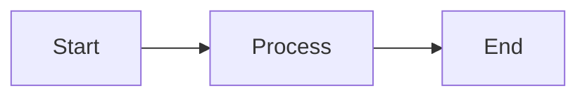

# Contributing to SQRBOK

Thank you for your interest in contributing to the **Software Quality and Reliability Body of Knowledge (SQRBOK)**! We welcome contributions from students, practitioners, and educators.

## Types of Contributions

We accept several types of contributions:

### 1. Content Fixes & Improvements
- **Typos and grammar corrections**
- **Fact checking** - Verify claims and update outdated information
- **Source validation** - Check citations, add missing references
- **Clarifications** - Improve explanations, add examples
- **Formatting fixes** - Fix markdown rendering issues

**How to contribute:** Submit a pull request with your changes. See [Quick Fixes](#quick-fixes) below.

### 2. Method/Technique Descriptions
Short focused pages (1-2 pages, ~100-180 lines) describing:
- A specific testing or quality assurance technique
- A particular aspect of software quality or reliability
- A practical tool or framework

**Template:** See [templates/method-template.md](templates/method-template.md)

### 3. Comparative Analysis Papers
Student papers or practitioner analyses (3-4 pages, ~200-300 lines) that:
- Compare different approaches to a problem
- Analyze trade-offs between methods
- Provide empirical evidence or case studies
- Include proper academic citations

**Template:** See [templates/analysis-template.md](templates/analysis-template.md)

---

## Contribution Guidelines

### Content Principles

1. **Atomic & Self-Contained**
   - Each page should cover ONE topic or method
   - Include all necessary context and references
   - Don't assume readers have read other pages

2. **Source Everything**
   - Cite original authors and frameworks
   - Provide links to academic papers or authoritative sources
   - Use IEEE citation style (handled by jekyll-scholar)
   - Place sources near the title OR in a dedicated Sources section at the end

3. **Practical Focus**
   - Move beyond theory to application
   - Include examples, checklists, or decision rules
   - Explain WHEN to use (and when NOT to use) a method

4. **Appropriate Length**
   - Short methods: 100-180 lines
   - Medium topics: 170-250 lines
   - Comparative analyses: 200-300 lines
   - If longer, consider splitting into multiple pages

5. **Visual Support**
   - Use Mermaid diagrams for processes and flows
   - Use tables for comparisons
   - Keep visuals simple and focused

### Quality Standards

- **Accuracy:** All facts and claims must be verifiable
- **Clarity:** Write for students and practitioners
- **Attribution:** Acknowledge original sources and authors
- **Consistency:** Follow existing page structure and style
- **Neutrality:** Present multiple perspectives when applicable

---

## Quick Fixes

For typos, formatting fixes, or small corrections:

1. **Fork** the repository
2. **Make your changes** in your fork
3. **Submit a pull request** with:
   - Clear description of what you fixed
   - Reference to the issue (if applicable)

**Example PR titles:**
- "Fix typo in coverage criteria definition"
- "Correct mutation testing formula"
- "Add missing citation to quality model paper"

---

## Adding New Content

### Before You Start

1. **Check existing content** - Avoid duplicating existing pages
2. **Choose the right template** - Method vs. Analysis
3. **Gather sources** - Have citations ready before writing
4. **Pick a topic area** - Determine which section (define, organization, verif, attributes, material, template)

### Step-by-Step Process

#### 1. Use the Template

Copy the appropriate template:
```bash
# For a method description
cp templates/method-template.md content/[section]/[your-topic].md

# For an analysis paper
cp templates/analysis-template.md content/[section]/[your-topic].md
```

#### 2. Fill in the Front Matter

```yaml
---
parent: Section Name  # e.g., "Defining Quality", "Verification and Validation"
title: Your Page Title
nav_order: X  # Check existing pages in that section
layout: default
---
```

#### 3. Write Your Content

- Follow the template structure
- Include sources/citations
- Add examples and practical guidance
- Keep it focused and atomic

#### 4. Add Visual Elements (Optional)

**Mermaid diagrams:**
````markdown

````

**Tables:**
```markdown
| Column 1 | Column 2 |
|----------|----------|
| Data     | Data     |
```

#### 5. Test Locally

```bash
bundle exec jekyll serve
# Visit http://localhost:4000 to preview
```

#### 6. Submit Pull Request

- **Title:** Clear, descriptive (e.g., "Add: Boundary value testing description")
- **Description:**
  - What you're adding
  - Why it's valuable
  - Any sources/references used
  - Confirmation you've tested locally

---

## Review Process

1. **Automated checks** - CI builds the site to ensure no errors
2. **Content review** - Maintainers review for:
   - Accuracy and quality
   - Proper citations
   - Adherence to style guide
   - Fit with existing content
3. **Feedback** - You may receive suggestions for improvements
4. **Merge** - Once approved, your contribution is merged!

---

## Style Guide

### Writing Style

- **Active voice** preferred
- **Short paragraphs** (3-5 sentences)
- **Bullet points** for lists
- **Bold** for key terms on first use
- *Italics* for emphasis or quotes
- `Code formatting` for technical terms or commands

### Markdown Conventions

- **Headings:** Use `##` for major sections, `###` for subsections
- **Line breaks:** Use `---` for section separators
- **Callouts:** Use Jekyll's callout syntax:
  ```markdown
  {: .highlight }
  **Note:** Important information here.
  ```
- **Escape special characters:** Use `\<` and `\>` for angle brackets in templates

### Citations

- Place full citation near title OR in dedicated "Sources" section
- Format: Author, Title, Publisher, Year, ISBN/URL
- Example:
  ```markdown
  **Source:** Pezze, Mauro, and Michal Young, _Software Testing and Analysis: Process, Principles, and Techniques_. Wiley, 2008. ISBN-13: 978-0471455936.
  ```

---

## Getting Help

- **Questions?** Open an issue with the "question" label
- **Discussion?** Start a discussion in GitHub Discussions
- **Bug report?** Open an issue with detailed description
- **Template unclear?** Ask in your pull request

---

## Code of Conduct

- Be respectful and professional
- Provide constructive feedback
- Acknowledge others' contributions
- Focus on improving the content, not criticizing contributors

---

## License

By contributing, you agree that your contributions will be licensed under the [Creative Commons Attribution 4.0 International License (CC BY 4.0)](LICENSE).

You must have the right to contribute the content and it must not infringe on others' intellectual property.

---

## Acknowledgments

All contributors will be acknowledged in the commit history and can be credited in the content itself for substantial contributions.

Thank you for helping improve SQRBOK! 🎉
