# Quality Dimensions by David A. Garvin (1984)

David A. Garvin  describes eight dimensions of quality that can be used to evaluate a product. These dimensions provide a framework for understanding the various aspects of what makes a product "good" and can help companies to strategically focus on particular elements of quality.

*   **Performance:** This refers to a product's primary operating characteristics. It involves measurable attributes and is often ranked on a scale. For instance, the acceleration of a car or the sound and picture quality of a television would fall under performance.
*   **Features:** These are the secondary characteristics of a product that supplement its basic functions. Features often differentiate one product from another in the same category.
*   **Reliability:** This refers to the probability of a product not failing within a specified time period. It is often measured by metrics like the mean time to first failure (MTTF) and the failure rate per unit time.
*   **Conformance:** This dimension measures the degree to which a product's design and operating characteristics match pre-established standards. It involves both internal (e.g., manufacturing processes) and external elements (e.g., design specifications).
*  **Durability:** This is a measure of the economic and technical life of a product. Technically, it can be defined as how long a product is useful before it deteriorates. It has both economic and technical dimensions.
*   **Serviceability:** This dimension focuses on the speed, courtesy, and competence of repair. It also includes the ease of product repair.
*   **Aesthetics:** This is a subjective dimension relating to how a product looks, feels, sounds, tastes, or smells. It is highly dependent on individual preferences.
*   **Perceived Quality:** This refers to a customer’s subjective assessment of a product's quality. It is often based on indirect measures, such as a brand's reputation or name.

It is important to note that these dimensions are not always independent of each other. For example, performance and features are often closely related. While some dimensions like reliability and conformance can be measured objectively, others, such as aesthetics, are more subjective. Companies can strategically prioritize different dimensions based on their products and market strategy.

The relative importance of each dimension varies according to different consumer needs. For example, the dimensions of quality that are important for a piano may differ greatly from the dimensions that are important for an automobile. Furthermore, it is difficult to improve all dimensions of quality simultaneously, as there are trade-offs that must be made. Therefore, businesses often need to focus on specific quality dimensions to gain a competitive advantage.

---

# McCall's Quality Factors (1977)

McCall's Quality Factors  are a set of characteristics introduced by Jim McCall in 1977 to measure and assess the quality of software systems. These factors help to evaluate software based on various attributes, contributing to a well-rounded understanding of software quality. McCall identified 11 quality factors, divided into three categories: **product operation**, **product revision**, and **product transition**.

```mermaid
flowchart LR
  A[McCall's Quality Factors]
  A --> B[Product Operation 📊]
  A --> C[Product Revision 🔧]
  A --> D[Product Transition 🌐]

  B --> B1[Correctness ✅<br>Reliability 🔒<br>Efficiency ⚡<br>Integrity 🔐<br>Usability 🖥️]
  C --> C1[Maintainability 🔄<br>Flexibility 🛠️<br>Testability 🧪]
  D --> D1[Portability 🌍<br>Reusability ♻️<br>Interoperability 🔗]
```

| **Factor**                     | **Description**                                                                                       | **Sub-Characteristics**                                       |
|---------------------------------|-------------------------------------------------------------------------------------------------------|---------------------------------------------------------------|
| **Product Operation** 📊       | Related to the system's performance during operation and how well it meets the user's needs.           | Correctness ✅, Reliability 🔒, Efficiency ⚡, Integrity 🔐, Usability 🖥️ |
| **Product Revision** 🔧        | Relates to the software's ability to evolve and adapt to changes.                                      | Maintainability 🔄, Flexibility 🛠️, Testability 🧪            |
| **Product Transition** 🌐     | Assesses how well the software can be transferred from one environment to another.                     | Portability 🌍, Reusability ♻️, Interoperability 🔗            |

## 1. Product Operation (Functional Characteristics) 📊

These factors are related to the system's performance during operation, focusing on how well it meets the user's needs.

- **Correctness** ✅: The extent to which the software meets its specified requirements.
- **Reliability** 🔒: The ability of the software to maintain its performance over time without failure.
- **Efficiency** ⚡: The software's ability to perform its functions using minimal system resources (e.g., memory, CPU).
- **Integrity** 🔐: Protection of the software from unauthorized access and data corruption.
- **Usability** 🖥️: The ease with which users can learn and operate the software.

## 2. Product Revision (Maintainability Characteristics) 🔧

These factors relate to the software's ability to evolve and adapt to changes.

- **Maintainability** 🔄: The ease with which software can be modified to correct defects, improve performance, or adapt to a changed environment.
- **Flexibility** 🛠️: The software's ability to accommodate changes in requirements or functionality.
- **Testability** 🧪: The ease with which software can be tested to ensure correctness and identify defects.

## 3. Product Transition (Adaptability Characteristics) 🌐

These factors assess how well the software can be transferred from one environment to another.

- **Portability** 🌍: The ability of the software to operate in different environments or on different platforms without significant modification.
- **Reusability** ♻️: The extent to which software components can be reused in different applications or systems.
- **Interoperability** 🔗: The ability of the software to work with other systems or software components, often from different vendors.

# ISO 9126 Quality Attributes

ISO 9126 is an international standard for software quality, which defines a set of **quality attributes** to assess and measure software quality. The standard consists of six main quality characteristics, each with specific sub-characteristics.

{: .note }
It is currently replaced by the **ISO/IEC 25002:2024**

```mermaid
flowchart LR
  A[ISO 9126 Quality Attributes]
  A --> B[Functionality ✅]
  A --> C[Reliability 🔒]
  A --> D[Usability 🖥️]
  A --> E[Efficiency ⚡]
  A --> F[Maintainability 🔄]
  A --> G[Portability 🌍]

  B --> B1[Suitability<br>Accuracy<br>Interoperability<br>Compliance<br>Security]
  C --> C1[Maturity<br>Fault Tolerance<br>Recoverability]
  D --> D1[Understandability<br>Learnability<br>Operability<br>Attractiveness]
  E --> E1[Time Behavior<br>Resource Utilization<br>Capacity]
  F --> F1[Analyzability<br>Changeability<br>Stability<br>Testability]
  G --> G1[Adaptability<br>Installability<br>Co-existence<br>Replaceability]
```

| **Quality Attribute**    | **Description**                                                              | **Sub-Characteristics**                                              |
|--------------------------|------------------------------------------------------------------------------|----------------------------------------------------------------------|
| **Functionality** ✅      | The set of features and capabilities the software offers to meet specified requirements. | Suitability, Accuracy, Interoperability, Compliance, Security          |
| **Reliability** 🔒        | The ability of the software to maintain its performance under specified conditions. | Maturity, Fault Tolerance, Recoverability                             |
| **Usability** 🖥️         | The ease with which users can learn, operate, and find value in the software. | Understandability, Learnability, Operability, Attractiveness          |
| **Efficiency** ⚡         | The ability of the software to perform its functions using minimal system resources. | Time Behavior, Resource Utilization, Capacity                         |
| **Maintainability** 🔄    | The ease with which the software can be modified to correct defects or adapt to changes. | Analyzability, Changeability, Stability, Testability                  |
| **Portability** 🌍       | The ability of the software to be transferred from one environment to another. | Adaptability, Installability, Co-existence, Replaceability            |

## 1. **Functionality** ✅

The set of features and capabilities the software offers to meet specified requirements.

- **Suitability**: The software provides the correct functionality for its intended tasks.
- **Accuracy**: The software provides correct results.
- **Interoperability**: The software can interact with other systems or components.
- **Compliance**: The software adheres to standards, regulations, or guidelines.
- **Security**: The software protects against unauthorized access and data breaches.

## 2. **Reliability** 🔒

The ability of the software to maintain its performance under specified conditions for a given period of time.

- **Maturity**: The likelihood of the software to fail based on its history and development.
- **Fault Tolerance**: The ability to continue functioning correctly even when some components fail.
- **Recoverability**: The ability of the software to recover from faults or failures.

## 3. **Usability** 🖥️

The ease with which users can learn, operate, and find value in the software.

- **Understandability**: The ease with which users can understand how the software works.
- **Learnability**: The ease with which users can learn to operate the software.
- **Operability**: The ease with which users can interact with the software to accomplish their tasks.
- **Attractiveness**: The aesthetic and emotional appeal of the software to users.

## 4. **Efficiency** ⚡

The ability of the software to perform its functions using minimal system resources.

   - **Time Behavior**: The software’s responsiveness in terms of speed and processing time.
   - **Resource Utilization**: The software’s use of system resources (e.g., CPU, memory).
   - **Capacity**: The ability of the software to handle the workload or data volume it is required to process.

## 5. **Maintainability** 🔄

The ease with which the software can be modified to correct defects, improve performance, or adapt to changes in the environment.
   
   - **Analyzability**: The ease with which the software can be examined for issues.
   - **Changeability**: The ease with which the software can be modified.
   - **Stability**: The likelihood that changes will not introduce new defects.
   - **Testability**: The ease with which the software can be tested for correctness.

## 6. **Portability** 🌍

The ability of the software to be transferred from one environment to another without significant modification.
   
   - **Adaptability**: The ease with which the software can be adapted to different environments.
   - **Installability**: The ease with which the software can be installed in a new environment.
   - **Co-existence**: The ability of the software to coexist with other software.
   - **Replaceability**: The ease with which the software can be replaced with other software.

[Source:Wiki](https://en.wikipedia.org/wiki/ISO/IEC_9126)

---

# Quality Attributes in ISO/IEC 25002:2024

ISO/IEC 25002:2024 builds on the previous work in quality models, particularly ISO/IEC 25010 (which defines product quality characteristics), but offers a more comprehensive overview for different contexts. The standard provides an organized structure for understanding and evaluating quality across systems, software, and IT services. Here are the primary quality attributes within the model:

```mermaid
flowchart LR
  A[ISO/IEC 25002:2024 Quality Model]
  
  A --> B[Functional Suitability ✅]
  A --> C[Performance Efficiency ⚡]
  A --> D[Compatibility 🔗]
  A --> E[Usability 🖥️]
  A --> F[Reliability 🔒]
  A --> G[Security 🔐]
  A --> H[Maintainability 🔄]
  A --> I[Portability 🌍]
  A --> J[Quality in Use ⭐]

  B --> B1[Functional Completeness<br>Functional Correctness<br>Functional Appropriateness]
  C --> C1[Time Behavior<br>Resource Utilization<br>Capacity]
  D --> D1[Coexistence<br>Interoperability]
  E --> E1[Appropriateness Recognizability<br>Learnability<br>Operability<br>User Error Protection<br>User Interface Aesthetics]
  F --> F1[Maturity<br>Availability<br>Fault Tolerance<br>Recoverability]
  G --> G1[Confidentiality<br>Integrity<br>Non-repudiation<br>Accountability<br>Authenticity]
  H --> H1[Modularity<br>Reusability<br>Analyzability<br>Modifiability<br>Testability]
  I --> I1[Adaptability<br>Installability<br>Replaceability]
  J --> J1[Effectiveness<br>Efficiency<br>Satisfaction<br>Freedom from Risk]
```

| **Main Attribute**        | **Sub-Characteristics**                                                   |
|---------------------------|---------------------------------------------------------------------------|
| **Functional Suitability** | Functional Completeness, Functional Correctness, Functional Appropriateness |
| **Performance Efficiency** | Time Behavior, Resource Utilization, Capacity                               |
| **Compatibility**          | Coexistence, Interoperability                                               |
| **Usability**              | Appropriateness Recognizability, Learnability, Operability, User Error Protection, User Interface Aesthetics |
| **Reliability**            | Maturity, Availability, Fault Tolerance, Recoverability                    |
| **Security**               | Confidentiality, Integrity, Non-repudiation, Accountability, Authenticity   |
| **Maintainability**        | Modularity, Reusability, Analyzability, Modifiability, Testability         |
| **Portability**            | Adaptability, Installability, Replaceability                               |
| **Quality in Use**         | Effectiveness, Efficiency, Satisfaction, Freedom from Risk                 |

## 1. Functional Suitability ⚙️

- **Definition**: The degree to which a system or software provides functions that meet stated and implied needs under specified conditions.
- **Characteristics**:
  - **Functional Completeness** ✅: Provides all required functions.
  - **Functional Correctness** ✔️: Functions work as expected.
  - **Functional Appropriateness** 🔧: Functions are appropriate for their intended purpose.

## 2. Performance Efficiency 🚀

- **Definition**: The performance relative to the amount of resources used under specified conditions.
- **Characteristics**:
  - **Time Behavior** ⏱️: How well the system performs over time.
  - **Resource Utilization** 💾: The efficiency in using system resources.
  - **Capacity** 📦: The system's ability to handle demands.

## 3. Compatibility 🔗

- **Definition**: The degree to which a system or software can operate in conjunction with other systems, software, or environments.
- **Characteristics**:
  - **Coexistence** 🧑‍🤝‍🧑: Ability to work alongside other systems.
  - **Interoperability** 🌐: Ability to interact with different systems.

## 4. Usability 🧑‍💻

- **Definition**: The degree to which a system or software can be used by specified users to achieve goals with effectiveness, efficiency, and satisfaction in a specific context of use.
- **Characteristics**:
  - **Appropriateness Recognizability** 👁️: Users can quickly recognize functions.
  - **Learnability** 📚: How easy it is for users to learn.
  - **Operability** 🔲: Ease of operation and use.
  - **User Error Protection** ⚠️: Safeguards against user mistakes.
  - **User Interface Aesthetics** 🎨: Appeal and design of the interface.

## 5. Reliability ⚡

- **Definition**: The degree to which a system or software performs its intended functions under specified conditions without failure.
- **Characteristics**:
  - **Maturity** 📈: The stability and experience of the system.
  - **Availability** ⏰: The system's operational availability.
  - **Fault Tolerance** 🛡️: Ability to withstand faults or issues.
  - **Recoverability** 🔄: Ease of recovery from failure.

## 6. Security 🔒

- **Definition**: The degree to which a system or software protects information and data from unauthorized access and ensures the integrity of data and operations.
- **Characteristics**:
  - **Confidentiality** 🕵️‍♂️: Ensures privacy of data.
  - **Integrity** 🔑: Protects against unauthorized data changes.
  - **Non-repudiation** 📜: Ensures actions can't be denied.
  - **Accountability** 👥: Tracks user actions and activities.
  - **Authenticity** ✔️: Verifies the legitimacy of data or operations.

## 7. Maintainability 🔧

- **Definition**: The degree to which a system or software can be modified to correct faults, improve performance, or adapt to a changed environment.
- **Characteristics**:
  - **Modularity** 🧩: Ability to break the system into modules.
  - **Reusability** 🔄: Components that can be reused in different contexts.
  - **Analyzability** 🔍: Ability to analyze and diagnose issues.
  - **Modifiability** ✏️: Ease of making modifications.
  - **Testability** 🧪: Ease of performing tests on the system.

## 8. Portability 🚚

- **Definition**: The degree to which a system or software can be transferred from one environment to another.
- **Characteristics**:
  - **Adaptability** 🔄: Ease of adapting to new environments.
  - **Installability** 🛠️: How easily the system can be installed.
  - **Replaceability** 🔄: Ability to be replaced with minimal disruption.

## 9. Quality in Use 🏆

- **Definition**: The degree to which a system or software achieves its intended purposes when used in a specific environment and by specific users.
- **Characteristics**:
  - **Effectiveness** 🎯: Achieving intended goals.
  - **Efficiency** ⚡: Performing tasks with optimal resource use.
  - **Satisfaction** 😊: The user's level of satisfaction with the system.
  - **Freedom from Risk** 🛡️: Minimizing risks in usage.

[Source: ISO](https://www.iso.org/standard/78175.html)

---

# Comparing Quality Models

| **Garvin's Quality Dimensions** | **McCall's Quality Factors**           | **ISO 9126 Quality Characteristics**      |
|---------------------------------|---------------------------------------|------------------------------------------|
| **Performance**                  | **Product Operation (Functional)**   | **Functionality**                        |
| The ability of a product to do its job well. | Correctness, Reliability, Efficiency, Integrity, Usability | Suitability, Accuracy, Interoperability, Compliance, Security |
| **Features**                     | **Product Operation (Functional)**   | **Functionality**                        |
| Characteristics or functions that add value. | Correctness, Reliability, Efficiency, Integrity, Usability | Suitability, Accuracy, Interoperability, Compliance, Security |
| **Reliability**                  | **Product Operation (Functional)**   | **Reliability**                          |
| The ability to perform consistently over time. | Maturity, Fault Tolerance, Recoverability | Maturity, Fault Tolerance, Recoverability |
| **Conformance**                  | **Product Operation (Functional)**   | **Functionality**                        |
| Meeting design specifications and standards. | Correctness, Reliability, Efficiency, Integrity, Usability | Compliance                               |
| **Durability**                   | **Product Revision (Maintainability)** | **Maintainability**                     |
| The product's ability to withstand wear and age. | Maintainability, Flexibility, Testability | Analyzability, Changeability, Stability, Testability |
| **Serviceability**               | **Product Revision (Maintainability)** | **Maintainability**                     |
| The ease with which the product can be repaired or serviced. | Maintainability, Flexibility, Testability | Analyzability, Changeability, Stability, Testability |
| **Aesthetics**                   | **Product Operation (Functional)**   | **Usability**                           |
| The product's appearance, how pleasant it is to use. | Usability | Understandability, Learnability, Operability, Attractiveness |
| **Perceived Quality**            | **Product Transition (Adaptability)** | **Portability**                         |
| The subjective judgment of quality by users or experts. | Portability, Reusability, Interoperability | Adaptability, Installability, Co-existence, Replaceability |
| **Efficiency**                   | **Product Operation (Functional)**   | **Efficiency**                          |
| The product's ability to achieve the desired outcomes with minimal resource usage. | Efficiency | Time Behavior, Resource Utilization, Capacity |

# Relational models

In his book, Zhu   presented models by Perry  and by Gilleis .

## Perry’s Model of Quality Attribute Relationships

Perry’s model  defines three types of relationships:

1. **Direct (+)**: If one attribute improves, the other improves too.
2. **Inverse (−)**: If one attribute improves, the other worsens.
3. **Neutral (N)**: The attributes are independent of each other.

### Examples:

| Relationship                               | Description                                                                                          |
|-------------------------------------------|------------------------------------------------------------------------------------------------------|
| **Integrity vs. Efficiency**              | Inverse (−): More control on data access (integrity) reduces efficiency due to more code.            |
| **Usability vs. Efficiency**              | Inverse (−): Improving user interface (usability) requires more code, reducing efficiency.           |
| **Maintainability and Testability vs. Efficiency** | Inverse (−): Well-commented code (for maintainability) reduces efficiency.                          |
| **Flexibility and Reusability vs. Integrity** | Inverse (−): Flexible data structures can create security risks.                                    |
| **Flexibility and Reusability vs. Maintainability** | Direct (+): Well-structured code is easier to maintain and reuse.                                   |
| **Portability vs. Reusability**           | Direct (+): Portable code is often well-structured and reusable.                                    |
| **Correctness vs. Efficiency**            | Neutral (N): Correct code can be either efficient or inefficient.                                   |

### Limitations:

- **Based on common sense**: Relationships may vary in complex, application-specific cases.
- **Commutativity assumption**: Relationships may not always be commutative (the same in both directions).

### Perry’s Model Detailed

| Factor               | C   | R   | E   | I   | U   | M   | T   | F   | P   | R   | I   |
|----------------------|-----|-----|-----|-----|-----|-----|-----|-----|-----|-----|-----|
| **Correctness (C)**   | **C** |     |     |     |     |     |     |     |     |     |     |
| **Reliability (R)**   | +   | **R** |     |     |     |     |     |     |     |     |     |
| **Efficiency (E)**    |     |     | **E** |     |     |     |     |     |     |     |     |
| **Integrity (I)**     |     |     | −   | **I** |     |     |     |     |     |     |     |
| **Usability (U)**     | +   | +   | −   | +   | **U** |     |     |     |     |     |     |
| **Maintainability (M)** | +   | +   | −   |     | +   | **M** |     |     |     |     |     |
| **Testability (T)**   | +   | +   | −   |     | +   | +   | **T** |     |     |     |     |
| **Flexibility (F)**   | +   | +   | −   |     | +   | +   | +   | **F** |     |     |     |
| **Portability (P)**   |     |     | −   |     |     | +   | +   |     | **P** |     |     |
| **Reusability (R)**   |     | −   | −   | −   |     | +   | +   | +   | +   | **R** |     |
| **Interoperability (I)** |     |     | −   | −   |     |     |     |     | +   |     | **I** |

*Figure. Perry’s relational model of software quality. (**+** - Direct, **−** - Inverse)*

## Gilleis’s Model of Quality Attribute Relationships

Gilleis  presented its own model model and dicussed relationships which are often not commutative. This means that although attribute A may reinforce attribute B, attribute B may not reinforce attribute A.

| Criteria                | R   | E   | I   | S   | U   | F   | EI  | P   | U   | A   | T   | T   | A   | U   | C   |
| ----------------------- | --- | --- | --- | --- | --- | --- | --- | --- | --- | --- | --- | --- | --- | --- | --- |
| **Reliability**         | O   | +   | +   | O   | O   | O   | O   | O   | O   | O   | O   | O   | O   | O   | O   |
| **Efficiency**          | O   | −   | −   | −   | −   | −   | −   | −   | O   | −   | +   | −   | −   | O   | −   |
| **Integrity**           | +   | −   | +   | +   | O   | −   | −   | +   | +   | −   | O   | O   | −   | O   | +   |
| **Security**            | +   | −   | +   | +   | O   | −   | −   | +   | +   | −   | O   | O   | −   | O   | −   |
| **Understandability**   | O   | −   | O   | O   | +   | O   | O   | O   | O   | −   | −   | O   | O   | O   | O   |
| **Flexibility**         | O   | −   | O   | O   | +   | O   | O   | O   | O   | −   | −   | O   | −   | O   | -   |
| **Ease of interfacing** | O   | O   | +   | +   | +   | +   | +   | +   | −   | −   | O   | O   | O   | O   | O   |
| **Portability**         | O   | −   | O   | O   | O   | +   | +   | O   | O   | −   | O   | O   | O   | O   | −   |
| **User consultation**   | O   | O   | +   | O   | +   | O   | O   | O   | O   | −   | O   | O   | O   | O   | O   |
| **Accuracy**            | +   | O   | +   | +   | +   | O   | O   | O   | +   | −   | O   | O   | O   | O   | O   |
| **Timeliness**          | −   | O   | −   | −   | O   | −   | −   | −   | −   | −   | −   | −   | −   | O   | −   |
| **Time to use**         | +   | +   | O   | O   | −   | −   | −   | O   | O   | O   | +   | +   | −   | O   | −   |
| **Appeal**              | +   | +   | O   | +   | +   | +   | +   | +   | +   | +   | +   | +   | +   |     |     |
| **User flexibility**    | O   | −   | O   | O   | O   | +   | O   | +   | +   | +   | O   | −   | O   | O   | O   |
| **Cost/benefit**        | +   | +   | +   | +   | +   | +   | O   | O   | +   | +   | +   | +   | O   | +   | +   |
| **User friendliness**   | +   | O   | O   | O   | O   | O   | O   | O   | +   | O   | −   | O   | +   | +   | O   |

*Figure. Gillies’ relational model of software quality criteria*
*(**O** No relationship or that the relationship is heavily context-dependent,**+** Direct, **−** Inverse)*

---

### References



---

{: .highlight }
**Disclaimer:** AI is used for text polishing and explaining. Authors have verified all facts and claims. In case of an error, feel free to file an issue.
