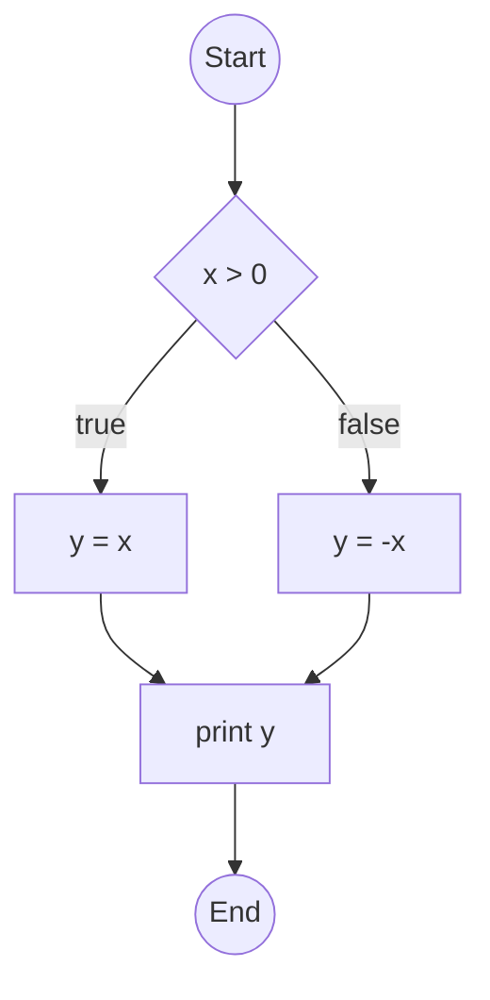
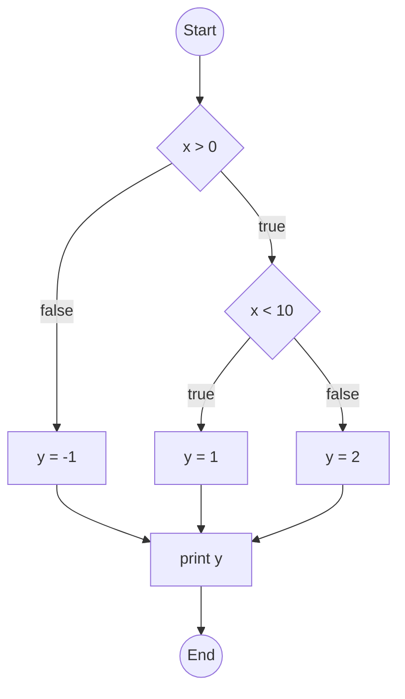
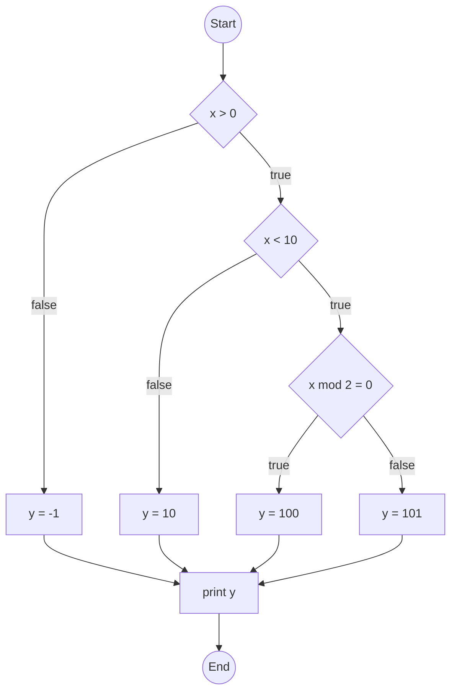

# Basis Path Coverage

{: .highlight }
Basis Path coverage is a practical alternative when All Path coverage requires too many test cases (almost everytime).

## Definition

**Basis Path Coverage** requires exercising a set of paths such that:

* Each path runs **from the entry to the exit** point of the **Control Flow Graph (CFG)**.
* Each path **introduces at least one edge** that is **not included** in any other path in the set.

This forms a **linearly independent set of paths**, known as a **basis set**.

{: .note }
Basis Path Coverage **subsumes branch coverage**, since covering all paths in a basis ensures that **all edges** in the CFG are traversed.

---

### Rationale

The main idea is to test each decision point **independently**:

* Each new basis path **flips exactly one previously executed decision**, while keeping all other decisions the same.
* This allows for detecting faults related to **individual decisions**, without relying on the interplay of multiple conditions.
* **Loop coverage**:

  * **Pre-test loops** (e.g., `while`, `for`) are executed:

    * **Zero times** (to test loop exit immediately).
    * **Once** (to test minimum loop entry).
  * **Post-test loops** (e.g., `do-while`) are executed **twice** (to test the loop condition after at least one iteration).

---

### Advantages

* ✅ Helps prevent **pathological test suites** that achieve statement or branch coverage without actually testing meaningful scenarios.
* ✅ Known **upper bound** on number of test cases, McCabe Cyclomatic Complexity  :

$$
  \text{# basis paths} = \text{Cyclomatic Complexity} = V(G) = e - n + 2
$$

Where:

  * $$e$$: number of edges
  * $$n$$: number of nodes

{: .highlight }
Alternativly, in simple cases, we may use $$V(G) = n+1$$, where $$n$$ is number of predicates (e.g. IFs).

* ✅ There is a well-defined **algorithm** to determine basis paths.
* ✅ More efficient than exhaustive **All Path Coverage**.

---

### Disadvantages

* ❌ May **miss faults** in **compound predicates**, where logical sub-conditions are not tested independently (see MCDC for stronger criteria).
* ❌ **Unfeasible paths** in the CFG (paths that can never be executed due to semantic constraints) reduce the practical applicability of 100% basis path coverage.

  * Causes:

    * **Duplicated decisions** (e.g., same condition used twice in a row).
    * **Data dependencies** that restrict path execution.
  * These reduce the effectiveness of the method to detect faults.

---

### Philosophical Justification

Every **decision** in a program corresponds to a **real-world situation** where the system must behave differently based on the input or state.

> If a decision (branch outcome) is not tested, the **requirements-based verification process** has failed to check whether the system behaves correctly in that **real-world case**.

* **Basis Path Testing** ensures that **each decision** is tested in **at least one operational context**.
* It guarantees that **special cases** identified by the developers are validated during testing.


## Examples

* Basis path testing uses **cyclomatic complexity** to define the number of **linearly independent paths** through a control flow graph (CFG).
* It ensures that **each edge** in the graph is exercised at least once, but **not necessarily every possible path**.
* Compared to **All Path Coverage**, it's much more **scalable**.

---

### Example 1 – One Decision Point

```fortran
input(x)

if x > 0 then
   y = x
else
   y = -x
end if

print(y)
```

**CFG:**



**Cyclomatic Complexity:**

$$
V(G) = 6 - 6 + 2 = 2
$$

same with

$$
V(G) = 1+1 = 2
$$

**Basis Paths:**

1. `Start → D1(true) → S1 → P → End`
2. `Start → D1(false) → S2 → P → End`
   (3rd path is linear combination but typically not separately tested)

✅ 2 test cases suffice (e.g., `x = 1` and `x = -1`)

---

### Example 2 – Two Decision Points

```fortran
input(x)

if x > 0 then
   if x < 10 then
      y = 1
   else
      y = 2
   end if
else
   y = -1
end if

print(y)
```

**CFG:**



**Cyclomatic Complexity:**

$$
V(G) = 8 - 7 + 2 = 3
$$

same with

$$
V(G) = 2+1 = 3
$$

**Basis Paths:**

1. `x > 0`, `x < 10` ⇒ `Start → D1(true) → D2(true) → S1 → P → End`
2. `x > 0`, `x ≥ 10` ⇒ `Start → D1(true) → D2(false) → S2 → P → End`
3. `x ≤ 0` ⇒ `Start → D1(false) → S3 → P → End`

✅ 3 test cases needed (e.g., `x = 5`, `x = 15`, `x = -2`)

---

### Example 3 – Three Decision Points

```fortran
input(x)

if x > 0 then
   if x < 10 then
      if x mod 2 = 0 then
         y = 100
      else
         y = 101
      end if
   else
      y = 10
   end if
else
   y = -1
end if

print(y)
```

**CFG:**



**Cyclomatic Complexity:**

$$
V(G) = 12 - 10 + 2 = 4
$$

same with

$$
V(G) = 3+1 = 4
$$

**Basis Paths:**

1. `x > 0`, `x < 10`, `x mod 2 = 0`
2. `x > 0`, `x < 10`, `x mod 2 ≠ 0`
3. `x > 0`, `x ≥ 10`
4. `x ≤ 0`

✅ Only 4 test cases required (e.g., `x = 4`, `x = 5`, `x = 15`, `x = -1`)

---

### Comparison: Basis Path vs All Path Coverage

| Property            | Basis Path Coverage                           | All Path Coverage                                            |
| ------------------- | --------------------------------------------- | ------------------------------------------------------------ |
| **# of test cases** | Linear in number of decisions (n+1)         | Exponential: $$2^n$$ for n decisions                           |
| **Goal**            | Cover all **edges** and **independent paths** | Cover **every possible execution path**                      |
| **Feasibility**     | Practical                                     | Often infeasible (many paths may be redundant or untestable) |
| **Redundancy**      | Minimal                                       | High (many paths may test the same logic repeatedly)         |
| **Example (n=3)**   | \~4 tests                                     | 8 tests (if all paths feasible)                              |

So, for **n decision points**, Basis Path typically requires only $$n + 1$$ test cases, while All Path Coverage requires $$2^n$$ — which grows very quickly.

### References



---

{: .highlight }
**Disclaimer:** AI is used for text polishing and explaining. Authors have verified all facts and claims. In case of an error, feel free to file an issue.
