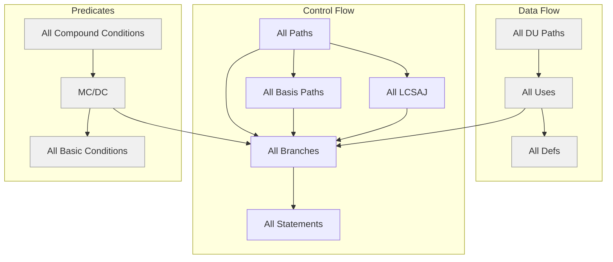
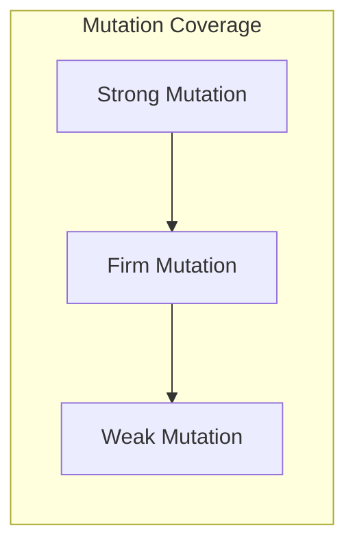
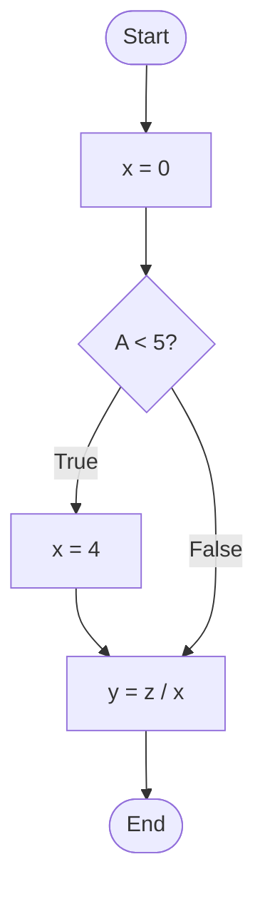
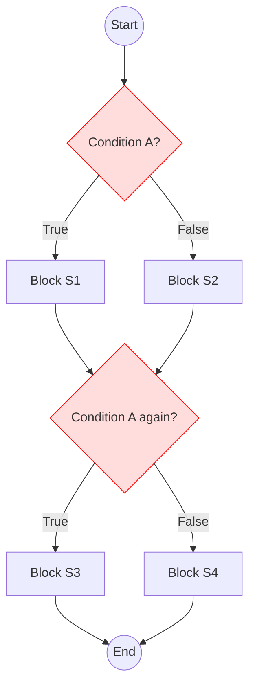

# Code Coverage

## Overview

**Code Coverage** is a measure used in software testing to describe the degree to which the source code of a program is tested by a particular test suite. It helps identify untested parts of a codebase.

### Types of Code Coverage



---

### Mutation Testing



---

## Statement Coverage

### Definition

Statement coverage requires **every statement (node in the control flow graph)** to be executed **at least once**.

* **Metric**:

  $$
  \text{Coverage}_{statement} = \frac{\text{Number of executed statements}}{\text{Total number of statements}}
  $$

* **Pros**: Simple to measure.

* **Cons**: Weak — it doesn’t consider control flow (e.g., decision paths).

---

### Example

```fortran
input (A)
x = 0
if A < 5 then
    x = 4
end if
y = z / x
```

#### Test case: `A = 2`

* All statements are executed → ✅ 100% **statement coverage**
* But if `A >= 5`, `x = 4` is skipped, and division by 0 causes a runtime error ❌

---

### CFG for Statement Coverage


✅ For `A=2`: All nodes visited
❌ For `A=6`: x remains 0 → division by zero not caught with only 100% statement coverage

---

### Discussion

Also known as:

* **Line coverage**
* **C0/C1 coverage**
* **Basic block coverage** (sequence of statements with no branches)

If some statements are never executed, then the verification process may have ignored some required functionality.

---

## Branch Coverage

### Definition

Branch coverage requires **each possible branch (true/false)** of every decision point to be **taken at least once**.

* **Subsumes**: Statement coverage (more thorough)

* **Metric**:

  $$
  \text{Coverage}_{branch} = \frac{\text{Number of executed branches}}{\text{Total branches}}
  $$

* **Pros**: Catches more faults than statement coverage

* **Cons**: May miss faults in compound conditions

---

### Example 1

Same code:

```fortran
input (A)
x = 0
if A < 5 then
    x = 4
end if
y = z / x
```

#### Test Suite 1: `A = 2`

* Covers only the **true branch**
* ❌ Branch coverage is not 100%
* ❌ Fault not revealed

#### Test Suite 2: `A = 2`, `A = 6`

* Covers **both branches** of the decision
* ✅ 100% branch coverage
* ✅ Division by zero fault detected (when `A = 6`)

---

### CFG for Branch Coverage



Both branches (`True` and `False`) from the condition are executed in full branch coverage.

---

### Example 2 – Branch Coverage Misses Faults

#### Requirement:

| A | B | Result |
| - | - | ------ |
| F | F | 0      |
| F | T | 1      |
| T | F | 2      |
| T | T | 2      |

#### Buggy implementation:

```fortran
input (A, B)
Z = 0
if A then
    Z = Z + 1
end if
if B then
    Z = 2
end if
print(Z)
```

#### Test Suite: `(A=T, B=T)` and `(A=F, B=F)`

* ✅ 100% branch coverage
* ❌ Bug in `Z = 2` overrides previous `Z = Z + 1`
* ❌ Output wrong for `(A=T, B=F)` (should be `2`, not `1`)

---

### Discussion

Also known as:

* **All-edges coverage** 
* **C2 coverage** 
* **Decision-decision-path testing**

Each decision divides operational scenarios into distinct cases. Good tests must explore all such cases.

---

## All Path Coverage

### Definition

All-path coverage requires that **every feasible path** through a program is executed.

* ✅ **Most thorough**
* ❌ **Impractical** for large programs:

  * With `n` decisions → up to `2^n` paths
  * Infeasible for complex software
  * Instead **basis path** coverage is used

---

## Unfeasible Paths

Some paths **can’t be executed** due to **semantic constraints**, even though they appear valid in the CFG.

#### Example:



Here, Condition A is checked **twice**, making some path combinations logically impossible (e.g., A true first, then false later).

---

### Realizable Complexity (rc)

_Reference: Beizer, B. Software Testing Techniques _

* **Realizable complexity (rc)**: Max number of distinct, testable paths
* May be **less than cyclomatic complexity** due to unfeasible paths
* **Undecidable** in theory: You can’t always determine which paths are testable (linked to the Halting Problem)

---

## More Coverage Criteria

* **Basis Path Coverage**: Cover enough paths using only `n + 1` (where `n` is the number of predicates)
* **Multiple Condition Coverage & MC/DC**
* **LCSAJ Coverage** (Linear Code Sequence And Jump)
* **Mutation Coverage**
* **Combinatorial Coverage**
* **Definition-Use (DU) Coverage**

---

### References



---

{: .highlight }
**Disclaimer:** AI is used for text polishing and explaining. Authors have verified all facts and claims. In case of an error, feel free to file an issue.
