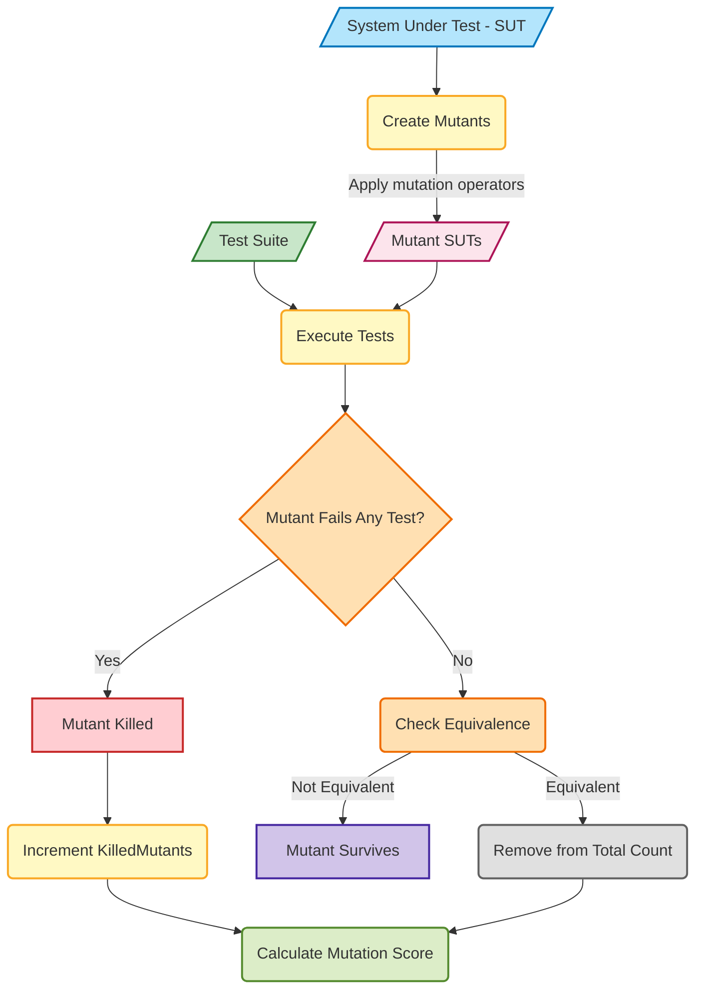

# Mutation Coverage

## What is Mutation Testing?

**Mutation Testing** measures the effectiveness (adequacy) of a test suite by checking whether it can detect _small, deliberate faults_—called **mutants**—that are introduced into the program.

These mutants are created by applying **mutation operators** that simulate common coding errors. If a test case detects the difference (i.e., it fails when run on the mutant), the mutant is said to be **killed**. Otherwise, it **survives**.

---

## Goal of Mutation Testing

> **Check if the test suite is good enough to "kill" faulty versions of the program.**

{: .highlight }
This helps assess whether your test cases are truly verifying program correctness.

---

## Mutation Operators

Mutants are created by making small changes to the original program. Common types include:

### Program-Level Mutations

| Mutation Type           | Description                               | Example Change               |
| ----------------------- | ----------------------------------------- | ---------------------------- |
| Relational Operator     | Change `>` to `>=`, `==` to `!=`, etc.    | `if (x > 0)` → `if (x >= 0)` |
| Conditional Operator    | Change `AND` to `OR`                      |                              |
| Arithmetic Operator     | Change `+` to `-`, `*` to `/`, etc.       | `x + y` → `x - y`            |
| Absolute Value          | Introduce `abs()` functions unnecessarily | `x` → `abs(x)`               |
| Value Shifting          | Increase/decrease constants by 1          | `x = 10` → `x = 9`           |
| Variable Replacement    | Replace one variable with another         | `y = x` → `y = z`            |
| Constant Change         | Change numeric or string constants        | `"abc"` → `"xyz"`            |
| Inject "Bomb" Functions | Insert a function that throws an error    | `if (x) ...` → `Bomb()`      |

### Interface/Integration Mutations

- Modify values sent to a **called method**.
    
- Modify the **call itself** (e.g., change method name or arguments).
    
- Change the **called method's internal behavior**, including:
    
    - Parameter changes
        
    - Class-level variable alterations
        
    - Changes to `return` statements
        

---

## Equivalent Mutants

Some mutants may be **equivalent** to the original—they result in the **same behavior** despite being syntactically different.  
**These mutants cannot be killed by any test.**

{: .important }
🧠 _Understanding equivalence is crucial during analysis!_

---

## Mutation Score

### Formula:

$$
\text{Mutation Score} = \frac{\text{Number of Killed Mutants}}{\text{Total Non-Equivalent Mutants}}
$$

This score reflects how well the test suite detects faults.

### Mutation Score Workflow



---

## Example

### Original Code (Fortran):

```fortran
if (x > 0) then
    y = 1
end if
```

### Mutant:

```fortran
if (x >= 0) then
    y = 1
end if
```

### Test Case:

Input: `x = 0`

- **Original behavior:** `if (x > 0)` → false → `y` is **not assigned**
    
- **Mutant behavior:** `if (x >= 0)` → true → `y = 1`
    

✅ **Result:** Mutant is **killed** because the test exposes a behavioral difference.

---

## Advantages

- Gives a **quantitative measure** of test suite quality.
    
- Detects **untested or weakly tested** parts of the code.
    
- Simulates **realistic faults** better than code coverage metrics alone.
    

---

## Disadvantages

- **Computationally expensive** (many mutants, many test runs).
    
- Requires effort to analyze **equivalent mutants**.
    
- Complex to automate and manage in large systems.
    

---

## 💡 Summary

|Concept|Description|
|---|---|
|**Mutant**|A modified version of the original program|
|**Killed Mutant**|A mutant that causes a test case to fail|
|**Surviving Mutant**|A mutant not detected by any test case|
|**Equivalent Mutant**|Syntactically different, but semantically same|
|**Mutation Score**|Proportion of killed mutants over all non-equivalent mutants|

---

{: .highlight }
**Disclaimer:** AI is used for text polishing and explaining. Authors have verified all facts and claims. In case of an error, feel free to file an issue.
