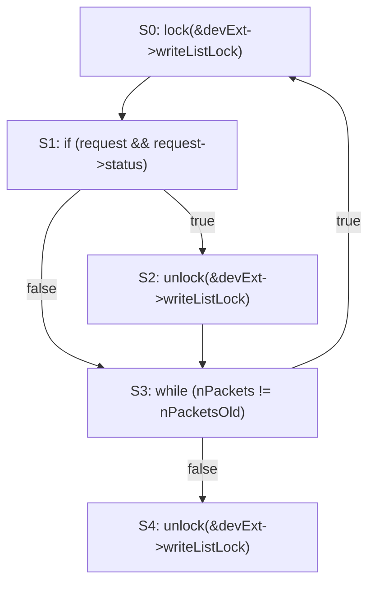
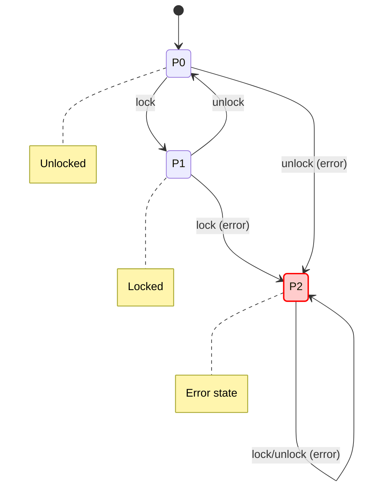
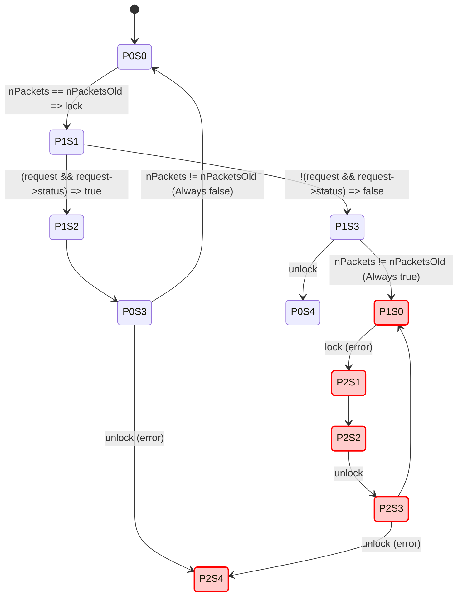

## Model Checking Example: Locking Discipline
  
  _Reference: G. Holzmann, Software Analysis and Model Checking _

We aim to verify whether a piece of code respects the _normal locking discipline_. Violations of this discipline can cause concurrency errors. According to this discipline, a single thread must **not**:

1. Attempt to **lock** a resource it already holds.
    
2. Attempt to **unlock** a resource it does **not** currently hold.
    
3. **Terminate** execution while still holding a lock.
    

This type of analysis is typically performed using **model checking**, a formal method used to systematically explore the states of a system.

---

## Code Under Analysis

We analyze the following C code:

```c
// Example from "Software Analysis and Model Checking" by G. Holzmann
do {
    lock(&devExt->writeListLock); // S0

    nPacketsOld = nPackets;
    request = devExt->WriteListHeadVa;

    if (request && request->status) { // S1
        devExt->WriteListHeadVa = request->nxt;
        unlock(&devExt->writeListLock); // S2
        nPackets++;
    }

} while (nPackets != nPacketsOld); // S3

unlock(&devExt->writeListLock); // S4
```

### Control Flow Representation



---

## Property to be Verified: Locking Discipline

We model the allowed states of a lock as a **finite state machine** (FSM). This model contains three states:

- `P0`: Unlocked
    
- `P1`: Locked
    
- `P2`: Error (violation of locking discipline)
    



---

## Product Automaton: Combining FSM with Code

We now combine the control flow of the code with the locking FSM into a _product automaton_. This lets us track both the control state of the program and the lock state.



---

## Analysis and Interpretation

- **Start State**: `P0` (Unlocked)
    
- **Accepting Final State**: `P0S4` (correct termination)
    
- **Error State**: `P2` (any transition here is a violation)
    

### Key Concepts

- **Accepting Runs**: All correct runs must start and end in `P0`. Ending in `P2` indicates a violation.
    
- **Strongly Connected Components (SCCs)**:
    
    - `C1 = { P0S0, P1S1, P1S2, P0S3 }` → valid execution paths
        
    - `C2 = { P2S0, P2S1, P2S2, P2S3, P2S4 }` → invalid, leads to or stays in error state
        

### Violations

- Any finite execution path from `P0S0` to `P2S4` indicates a **violation** of the locking discipline.
    
- Any infinite path that visits `P2S1` also violates the discipline.
    

---

## Essence

This example illustrates how **model checking** and **finite state machines** can be used to detect violations of locking protocols in concurrent software. By abstracting the program and modeling its behavior formally, we can systematically verify properties like proper locking and resource management—critical for ensuring reliability in multi-threaded applications.

---

### References



---

{: .highlight }
**Disclaimer:** AI is used for text polishing and explaining. Authors have verified all facts and claims. In case of an error, feel free to file an issue.
