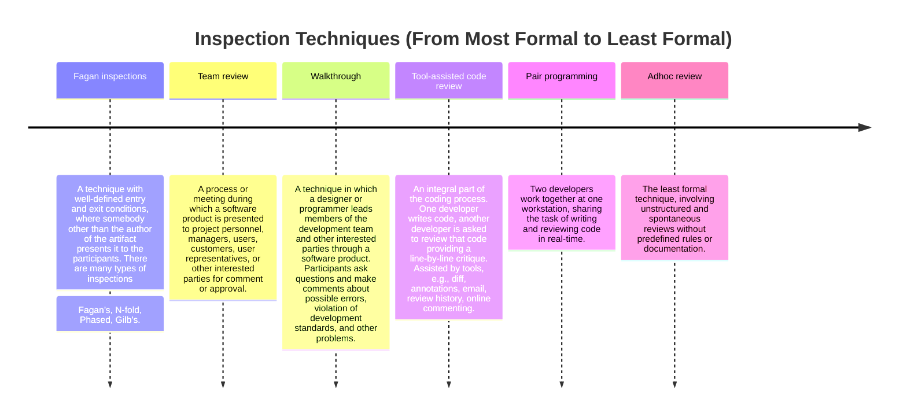

## 📖 **What is Inspection?**

### INCOSE Definition:
> **Inspection** is a verification method that determines performance by examining:  
> - **(a)** Engineering documentation produced during development or modification.  
> - **(b)** The item itself using **visual means** or **simple measurements** without requiring precision instruments.

### Practitioner’s Perspective:
> **Inspection** is the **systematic scrutiny of development artifacts** (e.g., code, design documents) by individuals **other than the creator**. This aims to:  
> - Meet contractual or project obligations.  
> - Detect non-conformities with standards.  
> - Uncover defects based on the idea that creators may overlook certain flaws in their own work.

---

### 🧰 **Uses of Inspection**
- **Complements testing**: Occurs earlier in the process and identifies issues before testing begins.  
- Suitable for detecting:  
  - **Faults of omission** (e.g., missing features).  
  - **Design problems** (e.g., structural inefficiencies).  
  - **Style issues** (e.g., improper formatting).  

---

### 🔍 **Examples of Inspection**
- Reviewing source code for proper commenting and adherence to style guidelines.  
- Identifying:  
  - Duplications in design.  
  - Misunderstandings or ambiguities in documentation.  
  - Incomplete functionality.  

---

## 🌟 **Benefits of Inspection**

1. **Early Defect Detection**:  
   - Reduces the cost and time required to fix issues later.  

2. **Quantifiable Business Impact**:  
   - Hewlett-Packard: **10:1 ROI**; savings of **$21.4 million/year**.  
     *(Source: Grady & Van Slack, IEEE Software, 1994) *  
   - AT&T Bell Labs: **10x improvement in quality**; **14% productivity gain**.  
     *(Source: Watts Humphrey, Managing the Software Process, 1989) *  
   - Bell Northern Research: Average savings of **33 hours/defect**.  
     *(Source: Russell, IEEE Software, 1991) *  
   - Cisco: Practical outcomes aligned with academic research.  
     *(Source: J. Cohen, Code Review at Cisco Systems, 2006) *  

3. **Comprehensive Defect Discovery**:  
   Identifies issues that may be **impossible or difficult to find** through testing alone.  

4. **Enhanced Team Collaboration**:  
   Encourages knowledge sharing and improves team communication.

---

## 🛠️ **Family of Inspection Techniques**

> *Adapted from K. Wiegers, Peer Reviews in Software: A Practical Guide (2002).*  

Below is a timeline of inspection techniques ranging from **most formal** to **least formal**:
 

### References



---

{: .highlight }
**Disclaimer:** AI is used for text polishing and explaining. Authors have verified all facts and claims. In case of an error, feel free to file an issue.
