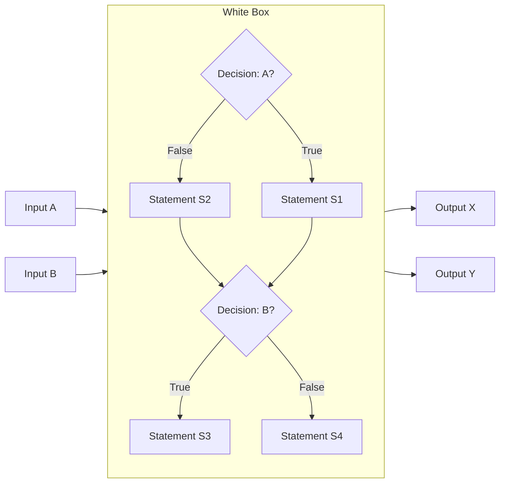
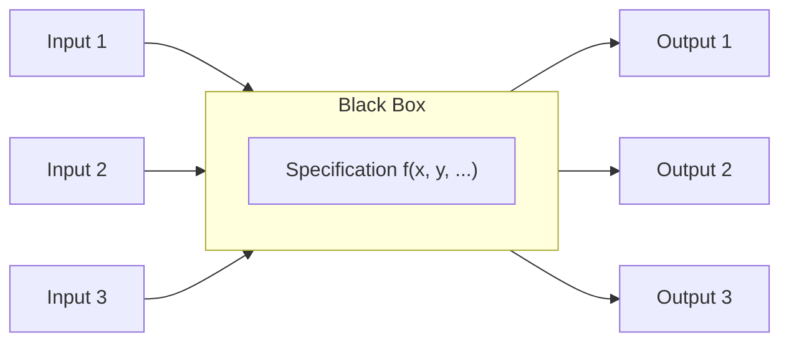

# White Box vs. Black Box Testing

## What Is White Box Testing?

White box testing (also known as structural or glass-box testing) involves examining the internal structure or workings of an application. The tester has knowledge of the source code and uses this to design test cases.

### Key Points:

* **Focus**: What is written (the code), not just what was intended (the specification).
* **Advantage**: Allows testers to design inputs that execute specific code paths, helping to discover hidden issues.
* **Purpose**:

  * Ensure all code paths are tested.
  * Discover unreachable or redundant code.
  * Find logic errors early in development.

### Characteristics:

* Can assess untested code features.
* Doesn't tell how well requirements are tested.
* Effective in early development stages.
* Typically performed by developers.

### Example (Fortran-style pseudocode):

```fortran
IF A THEN
    S1
ELSE
    S2
ENDIF

IF B THEN
    S3
ELSE
    S4
ENDIF
```

#### Diagram – White Box Testing Logic Flow



### White Box Testing Strategies:

* Execute **all code statements** at least once.
* Execute **both true and false paths** of each decision.
* Traverse all **independent execution paths**.

{: .highlight }
To test effectively, inputs must be crafted to trigger specific code paths. If inputs are chosen only based on requirements, some code might go untested. If chosen only based on code, some requirements might not be validated.

---

## What Is Black Box Testing?

Black box testing focuses on verifying the software’s functionality based on its specifications, without considering the internal code structure.

### Key Points:

* **Focus**: What the system is supposed to do, based on specifications.
* **Advantage**: Doesn't require knowledge of the internal code.
* **Purpose**:

  * Ensure the system meets the stated requirements.
  * Detect missing or incorrect functionality.

### Characteristics:

* Anyone (testers, users, domain experts) can design test cases.
* Code coverage isn't visible from the tests.
* Effective in system and acceptance testing.

#### Diagram – Black Box Testing Concept



### Black Box Testing Strategies:

* Test based on:

  * **Typical values**
  * **Boundary values**
  * **Invalid inputs**
  * **Combinations of data**
* Each function should:

  * Do what it’s supposed to.
  * Not do what it shouldn’t.

---

## Comparison Table

| **White Box Testing**                                   | **Black Box Testing**                                  |
| ------------------------------------------------------- | ------------------------------------------------------ |
| Tests internal structure and code logic                 | Tests system behavior and functionality                |
| Performed with full knowledge of code                   | Performed without code knowledge                       |
| Helps discover logic errors, unreachable code           | Helps discover missing or misimplemented functionality |
| Can assess which parts of code remain untested          | Can assess whether all requirements are tested         |
| Doesn’t indicate how thoroughly requirements are tested | Doesn’t indicate how thoroughly code is tested         |

---

## More Black Box Techniques

### Exploratory Testing

An unscripted approach where testers explore the software based on their intuition, experience, and understanding of the application.

#### Useful When:

* Formal specifications are missing or incomplete.
* The system is evolving and testers need to adapt quickly.

#### Limitations:

* **Lack of repeatability**: Different testers may explore different paths.
* **Risk of missed coverage**: Without structure, some features may be left untested.

#### Types:

* **Ad-hoc Testing**: Informal, based purely on experience.
* **Session-Based Testing**: Structured sessions with specific goals, followed by debriefing.


---

{: .highlight }
**Disclaimer:** AI is used for text polishing and explaining. Authors have verified all facts and claims. In case of an error, feel free to file an issue.
