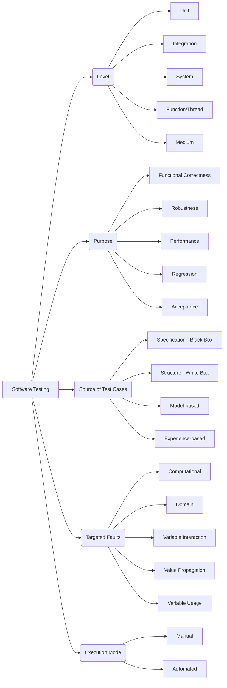

# 📘 What Is Testing?

### Definitions

**INCOSE (International Council on Systems Engineering):**

> Testing is a verification method that determines system or component performance by operating it using external tools or instrumentation (not built into the item). Any data analysis involved in testing should not rely on subjective interpretation or extrapolation.

**Software Engineering Perspective:**

> Testing is the process of executing software—partially or completely—with the goal of detecting faults **before release**, and to ensure that the software behaves **as expected**.

### Purpose of Testing

Testing helps us to:

* **Verify** that functional and performance requirements are met.
* **Find bugs and faults** early, ideally before software deployment.

### Practical Examples

* ✅ If a correct username and password are entered, the system logs the user in.
* ✅ The system can process 1,000 transactions per minute under load.

---

> 🧠 **Key Idea:** The primary goal of testing is **to make the software fail**.
> A good test is one that reveals a fault. Proving correctness is hard, but **falsifying a property** (i.e., showing that something doesn't work) is much easier and more practical.

---

# 🧪 Test Classification: A Taxonomy

Understanding how testing is classified helps in selecting the right kind of tests for different stages and goals of software development.

## 1. **By Level (Scope of the Test)**

| Level                 | Description                                         |
| --------------------- | --------------------------------------------------- |
| **Unit**              | Tests individual functions or methods in isolation. |
| **Integration**       | Tests how components or systems work together.      |
| **Thread / Function** | Focuses on execution paths or workflows.            |
| **System**            | Tests the entire application as a whole.            |
| **Medium**            | (Intermediate level—between unit and system.)       |

---

## 2. **By Purpose or What’s Being Tested**

| Purpose                    | Focus                                                 |
| -------------------------- | ----------------------------------------------------- |
| **Functional Correctness** | Does the system do what it’s supposed to?             |
| **Robustness**             | Does the system handle unexpected input or stress?    |
| **Performance**            | How well does the system perform under load?          |
| **Regression**             | Do old features still work after changes?             |
| **Acceptance**             | Does it meet the end user's or client’s expectations? |

---

## 3. **By Source of Test Cases**

| Source                  | Type of Testing                                                                        |
| ----------------------- | -------------------------------------------------------------------------------------- |
| **Specification-based** | Also known as **Black-box testing**. Based on requirements.                            |
| **Structure-based**     | Also known as **White-box testing**. Based on code structure.                          |
| **Model-based**         | Uses formal or informal models to derive tests.                                        |
| **Experience-based**    | Also called **Exploratory testing**. Relies on tester intuition and domain experience. |

---

## 4. **By Targeted Faults**

| Fault Type                | Description                                                                     |
| ------------------------- | ------------------------------------------------------------------------------- |
| **Computational**         | Incorrect logic or math operations.                                             |
| **Domain**                | Issues when inputs are outside expected domains.                                |
| **Variable Interactions** | Errors due to interactions between variables.                                   |
| **Value Propagation**     | Faults in how data flows through the program.                                   |
| **Variable Usages**       | Mistakes in how variables are declared or used (e.g., uninitialized variables). |

---

## 5. **By Execution Mode**

| Mode          | Description                                           |
| ------------- | ----------------------------------------------------- |
| **Manual**    | Testers run tests and evaluate results by hand.       |
| **Automated** | Tests are executed and validated by tools or scripts. |

---

## Visual summary

{: .highlight }
Note: Good tests are those that cause the program to FAIL (reveal bugs).

---

{: .highlight }
**Disclaimer:** AI is used for text polishing and explaining. Authors have verified all facts and claims. In case of an error, feel free to file an issue.
