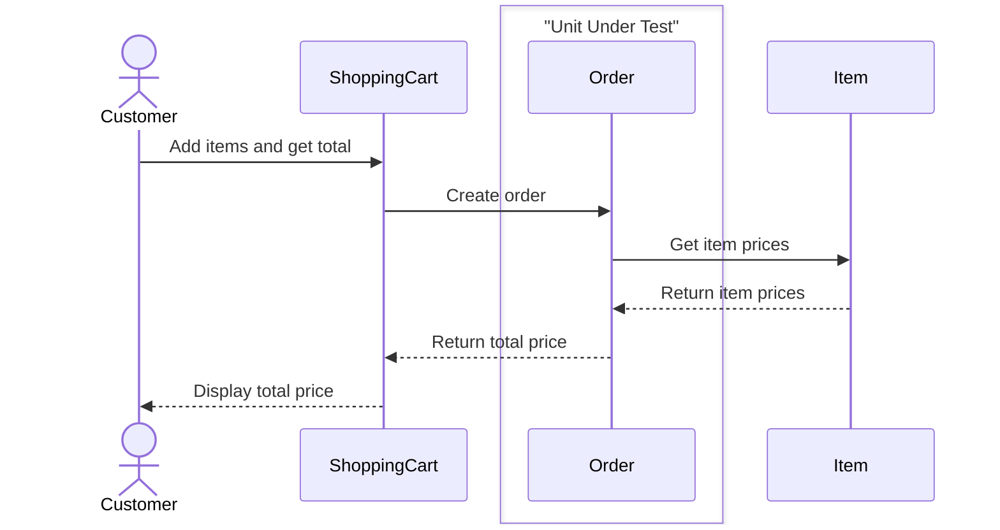
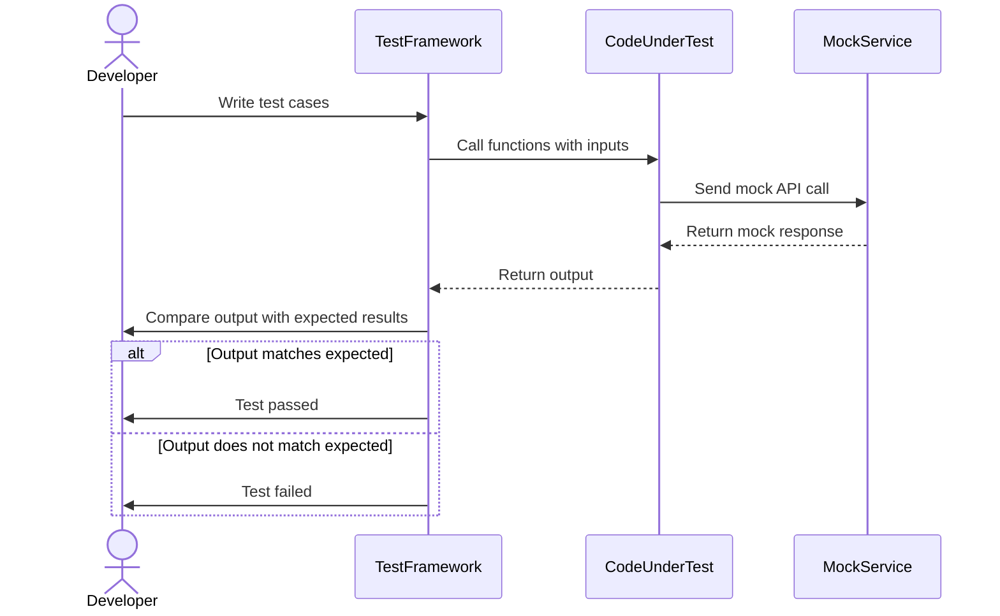
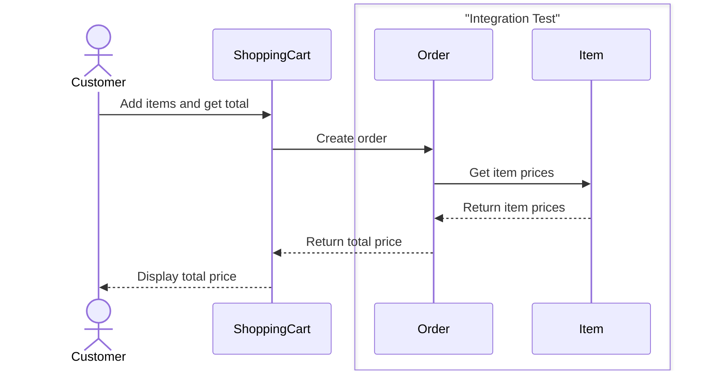
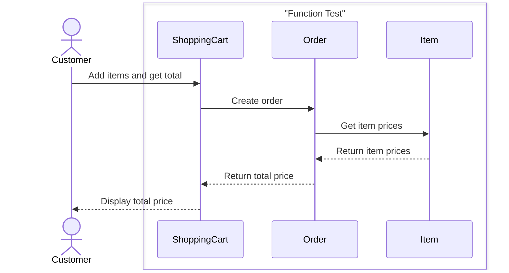
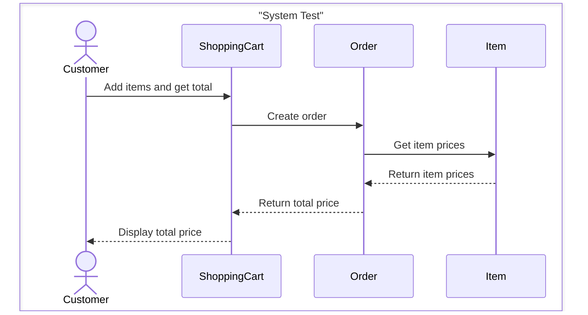

# ✅ Testing Techniques Structured by Levels

Software testing can be classified based on the *scope* or *level* of the system being tested. The goal is to verify software components in increasing scale and complexity—from individual functions to the entire system.

---

### 📋 Summary Table

| **Level**                     | **Description**                                                          |
| ----------------------------- | ------------------------------------------------------------------------ |
| **Unit Testing**              | Tests a single unit (e.g., function, method, object) in isolation.       |
| **Integration Testing**       | Tests interactions between multiple units or components.                 |
| **Thread / Function Testing** | Tests workflows or execution paths involving multiple interacting units. |
| **System Testing**            | Tests the complete and integrated system as a whole.                     |
| **Medium Testing**            | An intermediate testing level between unit and system testing.           |

---

## 🧪 Unit Testing

* A **unit** is typically a function, method, or class written by a developer.
* Unit testing focuses on **internal correctness** of that unit.
* It’s usually done **early** in development, before or after code reviews.
* **Simulated environment**: Uses *stubs* (dummy functions) and *drivers* (test harnesses).
* **Common faults**: Incorrect logic, boundary issues, data corruption, etc.
* **Test adequacy**: Measured using:

  * **Statement/branch coverage**
  * **Path coverage**
  * **MC/DC** (Modified Condition/Decision Coverage)
  * **Mutation testing**

### 🛒 Example: Unit Test of `Order` Object

### 🧪 Mocking in Unit Testing

Mocking simulates dependencies (like APIs or databases) to isolate the unit being tested.

---

## 🔗 Integration Testing

* Combines two or more **interacting units** and tests their interaction.
* **Typical faults**:

  * *Interface misuse*: Incorrect parameter usage or function calls.
  * *Interface misunderstanding*: Incorrect assumptions about a function’s behavior.
* Usually performed by developers or a dedicated testing team.
* **Test environment**: Development or staging.
* **Adequacy**: Measured via **node/edge coverage** of immediate connections.

### 🧪 Integration Test Example

---

## 🔁 Thread / Function Testing

* Tests **end-to-end workflows** or **execution paths** that span multiple components.
* Focuses on *functional correctness* of operations from input to output.
* Runs in a development or pre-production environment.
* Faults and defects are logged and reported for triaging.

### 🧪 Function Test Example

---

## 🖥️ System Testing

* Involves testing the **entire application**, including all subsystems and integrations.
* **Goal**: Validate that the system meets all **functional and non-functional** requirements.
* **Environment**: As close as possible to production.
* Performed by **independent QA** teams, not the developers.
* **Common issues** found:

  * Faulty interactions between components
  * Negative test cases (e.g., incorrect user input)
* **Adequacy** measured using:

  * **Combinatorial coverage**
  * **Mutation testing**

### 🧪 System Test Example

---

{: .highlight }
**Disclaimer:** AI is used for text polishing and explaining. Authors have verified all facts and claims. In case of an error, feel free to file an issue.
