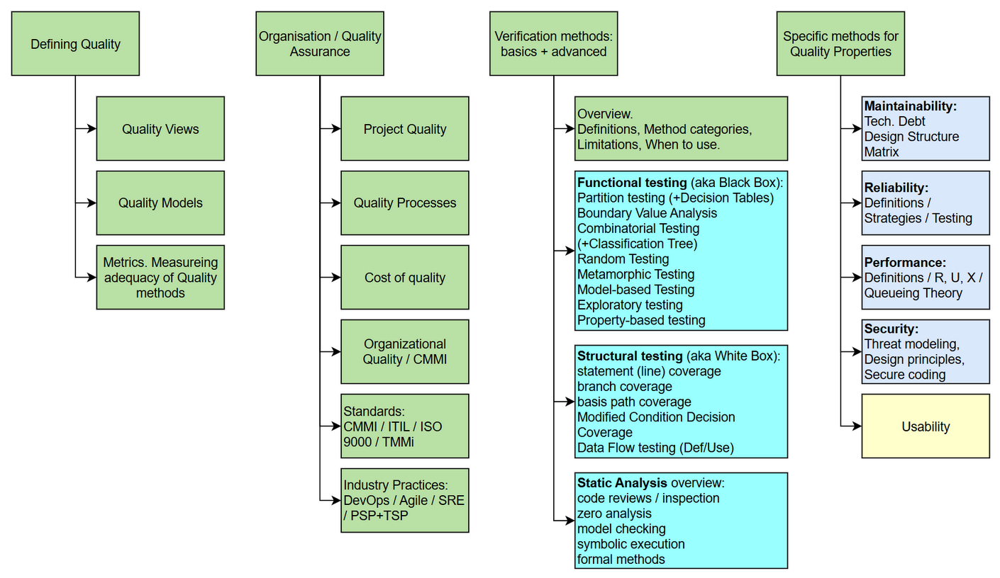
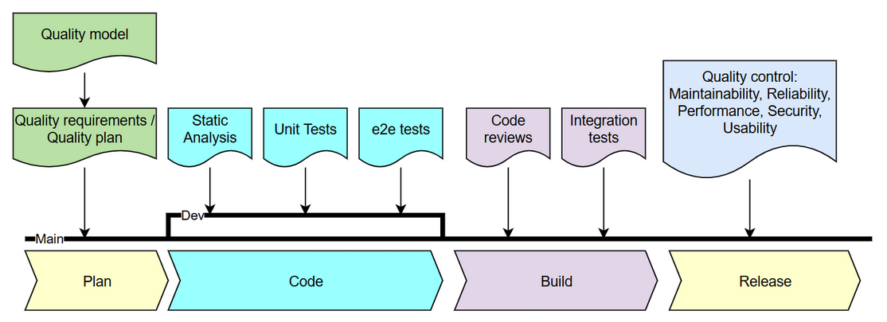

  

# Software Quality and Reliability 📘

Welcome to the course handbook for two complementary programs:

- **SQR** — Software Quality & Reliability (Bachelor)
- **QAM** — Quality Assurance & Management (Master, extends SQR with advanced topics)

This resource provides a comprehensive overview of key topics, combining theoretical foundations with practical applications.

---

## 📊 Overview  

**Course topic map** covers the full scope of both courses. It is organized into four areas: defining quality, organizing quality assurance, verification methods, and quality attributes. Topics marked in yellow are planned for future editions.

**Quality assurance in the development lifecycle** shows how quality activities integrate into a typical software project. Starting from a quality model and quality plan, the team applies verification techniques (static analysis, unit and e2e tests) during development, then code reviews and integration tests during the build phase, and finally evaluates non-functional quality attributes (maintainability, reliability, performance, security, usability) before release.

---

## 📂 Areas Covered  

### 1. [Defining Quality](/content/define/) 👥  
Understand the essence of software quality:  
- Quality views and perspectives  
- Quality models and metrics  
- Evaluating the adequacy of quality measures  

---

### 2. [Organizing Quality](/content/organization/) 🔄
Explore how to manage and assure quality effectively:
- The cost of quality
- Project-level quality management and planning
- Quality processes and process improvement
- Standards: CMMI, ITIL, ISO 9000, TMMi
- Industry practices: DevOps, Agile, SRE, PSP/TSP

---

### 3. [Verification and Validation](/content/verif/) 📏
Learn methods to ensure software reliability and correctness:
- V&V overview: definitions, method categories, when to use
- Black Box / functional: domain & boundary testing, equivalence partitioning, decision tables, classification trees, combinatorial testing, random & property-based testing, exploratory testing, operational profiles
- White Box / structural: statement, branch, MC/DC, data-flow coverage, mutation testing
- Inspection: code reviews, Fagan inspection process, reading techniques
- Static analysis: model checking, symbolic execution, dataflow analysis, tools

---

### 4. [Quality Attributes](/content/attributes/) 🧩
Dive into key software quality attributes:
- Maintainability
- Reliability
- Performance and queuing theory
- Security
- Usability

---

### 5. [Selected Materials](/content/material/) 📚  
Access curated references and resources:  
- Books  
- Research papers  
- Guides and online courses  

---

### 🎯 Objective  

These course notes aim to:  
- Provide a structured and accessible overview of software quality and reliability topics.  
- Equip readers with insights that bridge theoretical concepts and real-world applications.  
- Encourage collaboration and knowledge-sharing within the community.

---

Feel free to explore, contribute, and enhance your understanding of software quality and reliability!