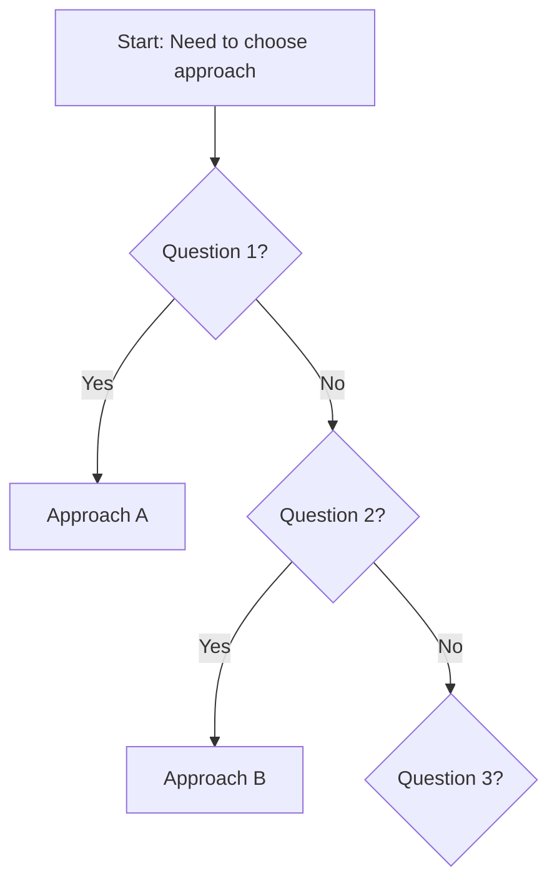

# [Analysis Title]: Comparing [Approach A] vs [Approach B]

*[Author attribution if student/practitioner paper]*

---

## Abstract

[2-3 sentence summary of what this analysis covers and the main finding/conclusion]

---

## 1. Introduction

### Context & Motivation

[Why this comparison matters - what problem or decision does it address?]

[What are the key questions this analysis answers?]

### Scope

This analysis compares [Approach A] and [Approach B] across the following dimensions:
- [Dimension 1]
- [Dimension 2]
- [Dimension 3]
- [Dimension 4]

---

## 2. Background

### [Approach A]

**What it is:** [Brief description]

**Key characteristics:**
- [Characteristic 1]
- [Characteristic 2]
- [Characteristic 3]

**Source:** [Full citation]

### [Approach B]

**What it is:** [Brief description]

**Key characteristics:**
- [Characteristic 1]
- [Characteristic 2]
- [Characteristic 3]

**Source:** [Full citation]

---

## 3. Comparative Analysis

### Comparison Matrix

| Dimension | [Approach A] | [Approach B] |
|-----------|--------------|--------------|
| [Dimension 1] | [Description] | [Description] |
| [Dimension 2] | [Description] | [Description] |
| [Dimension 3] | [Description] | [Description] |
| [Dimension 4] | [Description] | [Description] |
| **Strengths** | [List] | [List] |
| **Weaknesses** | [List] | [List] |
| **Best for** | [Context] | [Context] |

### Detailed Analysis

#### [Dimension 1]: [Name]

**[Approach A]:**
[Detailed explanation with evidence/examples]

**[Approach B]:**
[Detailed explanation with evidence/examples]

**Trade-offs:**
[What you gain vs what you lose with each approach]

#### [Dimension 2]: [Name]

[Same structure as above]

---

## 4. Case Studies / Examples

### Case Study 1: [Scenario Name]

**Context:** [Brief description of project/situation]

**Approach Used:** [Which approach was applied]

**Outcome:**
- [Result 1]
- [Result 2]
- [Lessons learned]

### Case Study 2: [Scenario Name]

[Same structure as above]

---

## 5. Decision Framework

**Use [Approach A] when:**
- [Condition 1]
- [Condition 2]
- [Condition 3]

**Use [Approach B] when:**
- [Condition 1]
- [Condition 2]
- [Condition 3]

[Optional: Decision flowchart]

---

## 6. Key Findings

1. **Finding 1:** [Main insight with supporting evidence]
2. **Finding 2:** [Main insight with supporting evidence]
3. **Finding 3:** [Main insight with supporting evidence]

---

## 7. Limitations & Future Work

**Limitations of this analysis:**
- [Limitation 1]
- [Limitation 2]

**Areas for further research:**
- [Question 1]
- [Question 2]

---

## 8. Conclusion

[2-3 paragraph summary of main findings and recommendations]

[Final recommendation or guidance for practitioners]

---

## References

1. [Full citation 1]
2. [Full citation 2]
3. [Full citation 3]
4. [Full citation 4]

**Additional Reading:**
- [Optional additional resources]

---

{: .highlight }
**Disclaimer:** AI is used for text polishing and explaining. Authors have verified all facts and claims. In case of an error, feel free to file an issue.
