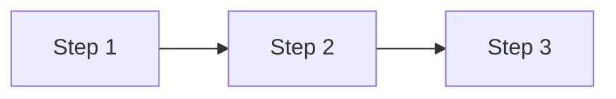

# [Method/Technique Name]

*[Optional: Brief attribution or context, e.g., "Based on XYZ framework by Author Name"]*

**Source:** [Author Name], [Title], [Publisher], [Year]. [ISBN or URL link]

---

## 1. What Is It?

[2-3 paragraph explanation of the core concept]

- **Key characteristic 1:** Brief explanation
- **Key characteristic 2:** Brief explanation
- **Key characteristic 3:** Brief explanation

[Optional: Simple diagram if helpful]

---

## 2. When to Use It

**Good fit when:**
- [Scenario 1]
- [Scenario 2]
- [Scenario 3]

**Not suitable when:**
- [Anti-pattern 1]
- [Anti-pattern 2]

---

## 3. How It Works

[Detailed explanation with steps or breakdown]

### Step 1: [Name]
[Explanation]

### Step 2: [Name]
[Explanation]

### Step 3: [Name]
[Explanation]

---

## 4. Example

[Concrete example showing application]

**Scenario:** [Brief context]

**Application:**
- [How the method was applied]
- [Key decisions made]
- [Outcome]

---

## 5. Common Pitfalls

- **Pitfall 1:** [Description and how to avoid]
- **Pitfall 2:** [Description and how to avoid]
- **Pitfall 3:** [Description and how to avoid]

---

## Key Takeaways

- [Main insight 1]
- [Main insight 2]
- [Main insight 3]

---

## Further Reading

[Optional: Additional sources]

- [Reference 1]
- [Reference 2]

---

{: .highlight }
**Disclaimer:** AI is used for text polishing and explaining. Authors have verified all facts and claims. In case of an error, feel free to file an issue.
